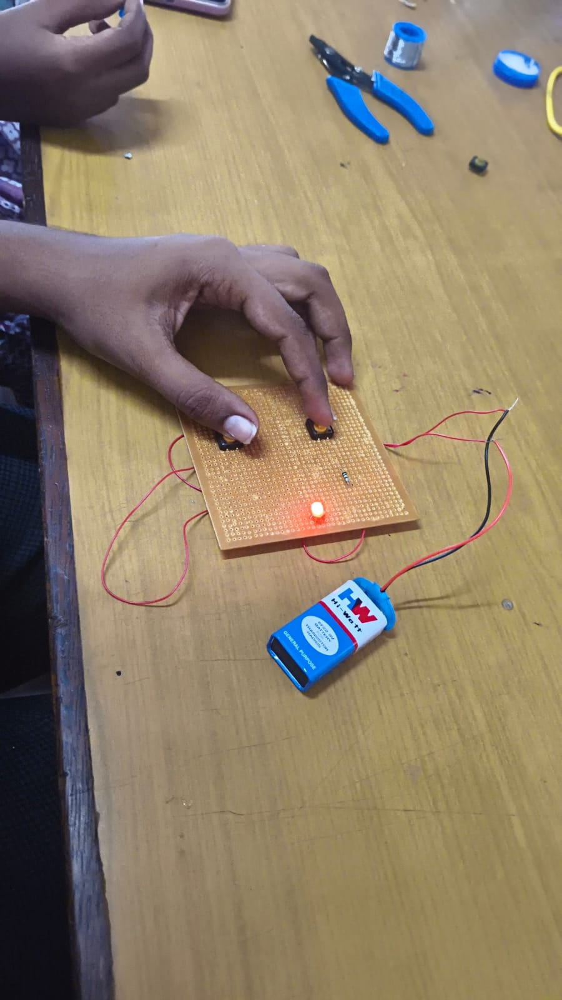

#_AND_Gate_Circuit

## Description
An AND gate is a basic digital logic gate.
It gives HIGH output only when both inputs are HIGH.

## Required Components
- AND Gate IC (7408)
- Breadboard
- LED
- Resistor
- Connecting Wires
- Power Supply
- Switches

## Project Setup

## Procedure
1. Place the AND gate IC on the breadboard.
2. Connect the power supply to the IC.
3. Connect two switches as inputs A and B.
4. Connect the LED to the output through a resistor.
5. Apply different input combinations and observe the output.

## Functions
- Performs AND logic operation.
- Takes two inputs.
- Gives HIGH output when both inputs are HIGH.
- Gives LOW output for other input combinations.
